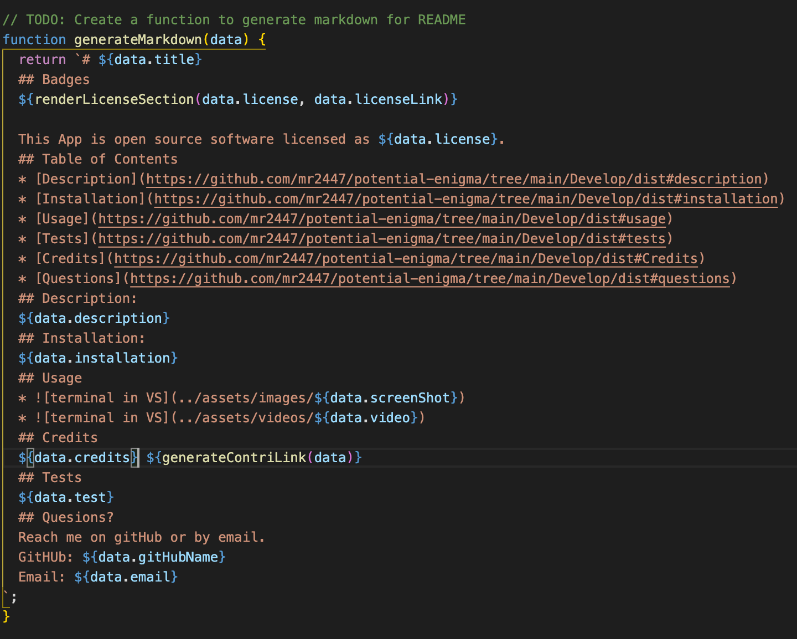

# README generator 
## Purpose
```
For developers, using this app can generate README files so that they can quickly create a professional README for a new project
```

## Built With
```
-nodeJS
-npm inquirer
-markdown
```
## Website

[GitHub repo](https://github.com/mr2447/potential-enigma/tree/main/Develop/dist)

## Contribution
```
Made with ❤ by Marvin Ren
```
## Screen Shot

