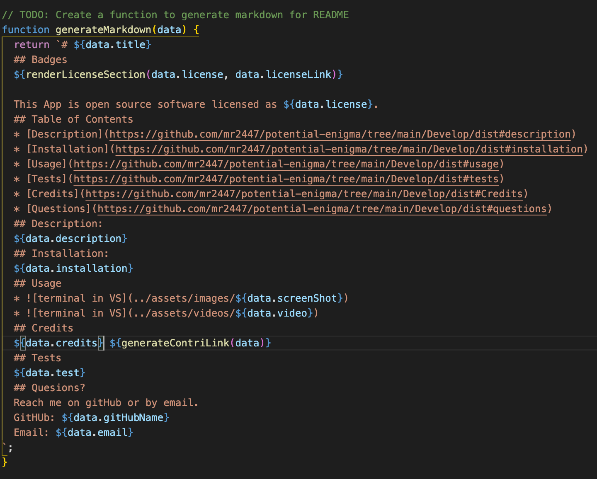
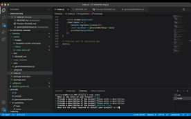

# potential-enigma
  ## Badges
  
  
  
  This App is open source software licensed as MIT.
  ## Table of Contents
  * [Description](https://github.com/mr2447/potential-enigma/tree/main/Develop/dist#description)
  * [Installation](https://github.com/mr2447/potential-enigma/tree/main/Develop/dist#installation)
  * [Usage](https://github.com/mr2447/potential-enigma/tree/main/Develop/dist#usage)
  * [Tests](https://github.com/mr2447/potential-enigma/tree/main/Develop/dist#tests)
  * [Credits](https://github.com/mr2447/potential-enigma/tree/main/Develop/dist#Credits)
  * [Questions](https://github.com/mr2447/potential-enigma/tree/main/Develop/dist#questions)
  ## Description: 
  Generates a ReadMe file for quick creation.
  ## Installation: 
  run npm i
  ## Usage
  * 
  * 
  ## Credits 
  Marvin Ren https://github.com/mr2447/potential-enigma/tree/main/Develop/dist#description
  ## Tests
  no tests
  ## Quesions?
  Reach me on gitHub or by email. 
  GitHub: mr2447
  Email: marvin.ren@yahoo.com
